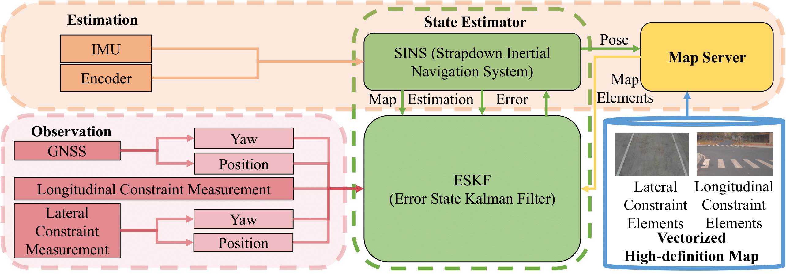
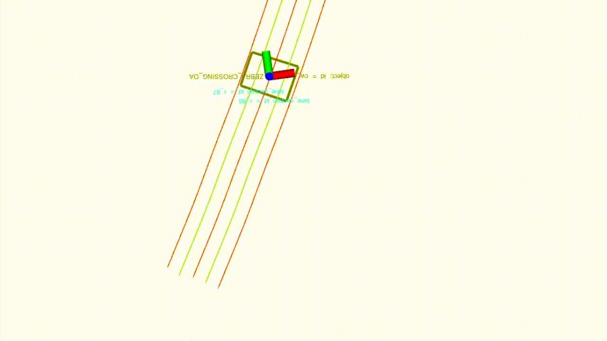

<div align="center">
<a href="https://ieeexplore.ieee.org/document/10497895"></a>
</a>
<a ></a>
<a href="https://github.com/liuhj86/VHDMap-SE/stargazers">

</a>
<a href="https://github.com/liuhj86/VHDMap-SE/network/members">

</a>
<a href="https://github.com/liuhj86/VHDMap-SE/issues">

</a>
</div>

## Introduction

This is the official code repository of "VHDMap-SE: A Universal Vectorized High-definition Map Aided Vehicle State Estimator", which is accepted by IEEE Transactions on Intelligent Vehicles'24.

VHDMap-SE presents a universal UGV state estimation system and a query-based vectorized high-definition (VHD) map data exchange protocol. The system utilizes VHD maps to correct the lateral and longitudinal positions as well as the yaw orientation of UGVs. The data exchange protocol enables UGVs to obtain real-time VHD map information and process it efficiently. We provide comprehensive experimental results that showcase the effectiveness, accuracy, and robustness of our proposed system both in simulation and real-world scenarios. 

Its main features are:
+ The system only utilizes common traffic elements in VHD map to correct UGV states, which includes lateral position, longitudinal position and yaw orientation. 
+ The system accommodates the universal VHD map formats [ASAM OpenDRIVE](https://www.asam.net/standards/detail/opendrive/) and [Apollo OpenDRIVE](https://github.com/ApolloAuto/apollo/tree/master).
+ The system adopts a query-based VHD map data exchange protocol to interact with VHD map server in real time. By using such a mechanism, VHD map data can be distributed from a central server to numerous agents.


<!-- <div align="center">
    
</div> -->
<div align="center">
    
</div>
<div align="center">
    
</div>
<div align="center">
    
</div>
<div align="center">
    
</div>

## Prerequisites
### ROS
Follow the [official guide](http://wiki.ros.org/ROS/Installation) to install ROS1.
<!-- ### Python Dependencies
```
pip install -r requirements.txt
``` -->
<!-- ### GTSAM
Follow the [official guide](https://gtsam.org/get_started/) to install GTSAM with [Python Bindings](https://github.com/borglab/gtsam/blob/develop/python/README.md). -->
<!-- ### OpenLane ROS Package
```angular2html
mkdir -p catkin_ws/src
cd catkin_ws/src
git clone https://github.com/qiaozhijian/openlane_bag.git
``` -->
## Build
```angular2html
mkdir ws
cd ws
mkdir src
cd src
git clone https://github.com/liuhj86/VHDMap-SE.git
cd ..
catkin_make
```

<!-- ## OpenLane Example
We validate the method based on the [OpenLane](https://github.com/OpenDriveLab/OpenLane) dataset. Users need to download this dataset and the rosbags we provide after preprocessing with [openlane_bag](https://github.com/qiaozhijian/openlane_bag.git).

Specifically, we use [PersFormer](https://github.com/OpenDriveLab/PersFormer_3DLane) to predict 3D lane markings and save them along with GT and calibration parameters ([Details](docs/annotation.md)). The camera coord sys (OpenLane) is x-front, y-left, z-up. 
However, you may feel confused if you want preprocess by yourself using [PersFormer](https://github.com/OpenDriveLab/PersFormer_3DLane). Because its camera coord sys is different from OpenLane (please refer to [issue 24](https://github.com/OpenDriveLab/OpenLane/issues/24).

Rosbag download link [[OneDrive]](https://hkustconnect-my.sharepoint.com/:u:/g/personal/zqiaoac_connect_ust_hk/EQxCBwl1Wc5Foq1wNOJ7ZKQBrNik0GK_qa7qEed_zrbGmQ?e=bYSYvk)[[Baidu Cloud]](https://pan.baidu.com/s/1Hrd8ashoiB4_f0B-iz6OHQ?pwd=2023)

Unzip the downloaded file and put it in the `OpenLane dataset` folder.
```angular2html
├── OpenLane
│   └── lane3d_1000
│       ├── rosbag
│       └── test
│       └── validation
│       └── training
```
Modify the `config/lane_mapping.yaml` file to change the dataset path.
```angular2html
dataset:
    name: "openlane"
    dataset_dir: "/media/qzj/Document/datasets/OpenLane/"
```
**Quick Start**
```
python examples/demo_mapping.py --cfg_file=config/lane_mapping.yaml
```
**Reproduce the results in the paper**
```
#In this step, users need to download the original [OpenLane](https://github.com/OpenDriveLab/OpenLane) dataset and merge it with our provided dataset.
cd src/MonoLaneMapping
# lane mapping and save the results
python examples/mapping_bm.py --cfg_file=config/lane_mapping.yaml
# evaluation of lane recall and precision
python examples/openlane_eval3d.py --cfg_file=config/lane_mapping.yaml
# lane association evaluation
python examples/lane_association.py --cfg_file config/lane_association.yaml --bm
```
**Toy example for curve fitting**
```
python examples/demo_curve_fitting.py
``` -->
## Run
```
source devel/setup.bash
roslaunch VHDMap-SE estimator.launch
```
## Observation Protocols
| Item   |  Topic | Data Flow| Message Type  | Description                                                      |
| ----- | -----| -----|-----|------------------------------------------------------------ |
| Lane Observation | /camera/lane | others->system | sensor_msgs::NavSatFix | 1. Distance to the left lane line: msg.position_covatiance[0]; <br>2. Inclination angle of the left lane line (rad): msg.position_covatiance[1];<br>3. Distance to the right lane line: msg.position_covatiance[2]; <br>4. Inclination angle of the left lane line (rad): msg.position_covatiance[3].|
| Longitudinal Observation | /longitudinal_constraint_measurement | others->system |geometry_msgs::PoseArray | 1. Distance of the longitudinal constraint target relative to the UGV along the X-axis direction in ENU frame: msg.poses[0].position.x; <br>2. Distance of the longitudinal constraint target relative to the UGV along the Y-axis direction in ENU frame: msg.poses[0].position.y; <br>3. Distance of the longitudinal constraint target relative to the UGV along the Z-axis direction in ENU frame (if there is Z-coordinate in map): msg.poses[0].position.z; <br>4. Distance measurement variance: msg.poses[3].position.x.|
| Map Request | Lane Request: /map/request/lane <br>Longitudinal Constraint Point Request: /map/request/lc | system->map | nav_msgs::Odometry | 1. UGV position: msg.pose.pose.position; <br>2. UGV orientation: msg.pose.pose.orientation.|
| Lane Map Response | /map/response/lane | map->system |sensor_msgs::PointCloud | 1. Points valid flag: msg.channels[0].values[0]; <br>2. Index of the separation point for the left and right lane line points: msg.channels[1].values[0]; <br>3. Lane line points: msg.points[0-size].|
| Longitudinal Map Response | /map/response/lc | map->system | geometry_msgs::PoseArray | 1. Longitudinal constraint points: msg.points[0-size].|

## Citation
If you find this work useful in your research, please consider citing:
```
@ARTICLE{10497895,
  author={Liu, Hongji and Tang, Mingkai and Jia, Mingkai and Chen, Yingbing and Wu, Jin and Liu, Ming},
  journal={IEEE Transactions on Intelligent Vehicles}, 
  title={VHDMap-SE: A Universal Vectorized High-definition Map Aided Vehicle State Estimator}, 
  year={2024},
  volume={},
  number={},
  pages={1-15},
  keywords={State estimation;Roads;Real-time systems;Global navigation satellite system;Simultaneous localization and mapping;Protocols;Location awareness;intelligent vehicles;state estimation;HD map},
  doi={10.1109/TIV.2024.3388204}}
```

## License
This project is licensed under the MIT License - see the [LICENSE](LICENSE) file for details.
